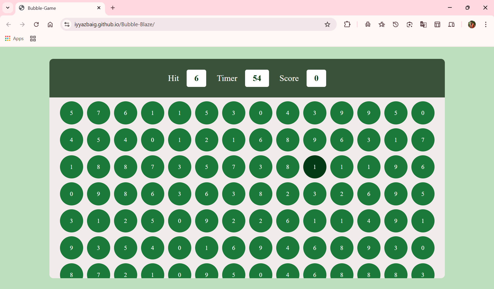

# 🎮 Bubble Blaze

An interactive browser-based number recognition game designed to enhance cognitive and reflex skills through fast-paced gameplay.

## 📝 Description

Bubble Blaze is an engaging web-based game that combines entertainment with cognitive skill development. Players match randomly appearing numbers against a target, racing against the clock to maximize their score. The dynamic scoring system, real-time timer functionality, and random number generation create a challenging yet fun experience for users of all ages.

## ✨ Features

- **Dynamic Scoring System** - Earn points for correct matches with progressive difficulty
- **Real-time Timer** - Countdown timer to add urgency and challenge to gameplay
- **Random Number Generation** - Unique bubble arrangements for every game session
- **Engaging UI Design** - Beautiful green-themed interface with smooth animations
- **Responsive Interactions** - Instant visual feedback for player actions
- **Game Statistics** - Track your hits, timer, and score in real-time

## 📸 Screenshot

*The game displays a grid of numbered bubbles with a target number at the top. Players click the matching number to score points.*

## 🎮 How to Play

1. **Start the Game** - Open `index.html` in your web browser
2. **Find the Target** - Look at the target number displayed at the top
3. **Click the Match** - Click on the bubble containing the matching number
4. **Score Points** - Earn points for each correct match
5. **Beat the Clock** - Complete as many matches as possible before time runs out
6. **Challenge Yourself** - Try to beat your previous high score!

## 🛠️ Technologies Used

- **HTML (25.9%)** - Page structure and semantic markup
- **CSS (40.6%)** - Styling, animations, and responsive design
- **JavaScript (33.5%)** - Game logic, interactivity, and number generation

## 🚀 Getting Started

No installation required! Simply:
1. Clone or download this repository
2. Open `index.html` in any modern web browser
3. Start playing and have fun!

## 📊 Game Statistics

- **Hit Count** - Number of correct matches
- **Timer** - Remaining time in seconds
- **Score** - Total points accumulated

## 🎯 Game Mechanics

- Each correct match increments your hit counter
- Score increases with successful matches
- Timer counts down from start to create urgency
- Bubbles contain random numbers 0-9
- Game ends when timer reaches zero

## 💡 Skills Enhanced

- **Number Recognition** - Quickly identify and match numbers
- **Reflex Speed** - Improve reaction time through gameplay
- **Focus & Concentration** - Maintain attention under time pressure
- **Hand-Eye Coordination** - Accurate clicking under time constraints

---

Made with ❤️ to combine learning with entertainment